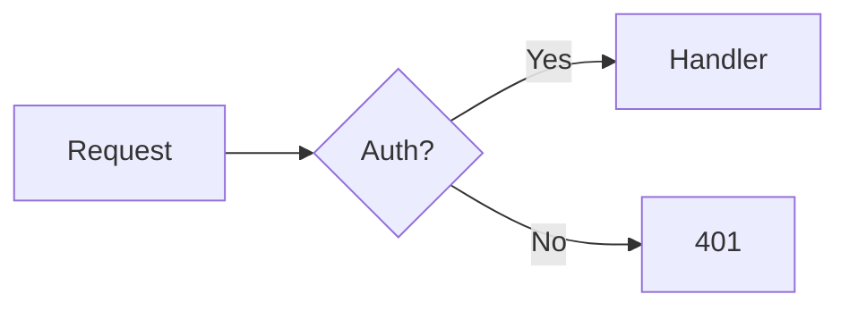

# termrender

Rich terminal rendering of directive-flavored markdown.

## What this is

termrender takes markdown with lightweight directives and renders it as formatted terminal output with borders, colors, tree views, side-by-side columns, syntax highlighting, and mermaid diagrams.

## Why this exists

LLM agents are terrible at formatting terminal output. Not because they can't — because the cost is absurd.

Ask an agent to produce a bordered status panel and watch what happens. It manually draws every `━` character, pads every line to the right width, counts columns, aligns content. A simple box with three bullet points runs 200+ output tokens, and almost all of them are decorative characters the agent computed one by one.

To draw a panel the traditional way, the agent has to generate something like this:

```
╭─ Deploy Status ───────────────────╮
│                                   │
│  ✔  Unit tests passed             │
│  ✔  Lint clean                    │
│  ✖  Integration: 2 failures       │
│                                   │
╰───────────────────────────────────╯
```

Every box-drawing glyph, every padding space, every repeated dash. All tokens.

With termrender, the agent writes this instead:

```markdown
:::panel{title="Deploy Status" color="green"}
- ✔ Unit tests passed
- ✔ Lint clean
- ✖ Integration: 2 failures
:::
```

Same visual result. About 10 tokens of directive syntax versus 200+ tokens of manual box drawing. The agent writes structure. termrender handles pixels.

Output tokens are the bottleneck in LLM-powered tools. They're slower to produce than input tokens and they eat context window. Cutting 95% of the formatting overhead means faster responses and more room for the content that actually matters.

There's a second thing. Agents are bad at visual layout. Counting characters, padding to exact widths, aligning columns across lines — LLMs get this wrong all the time. Off-by-one padding, broken box corners, widths that don't match. With directives, the agent can't screw up the formatting because it never touches it.

## What it looks like

Here's a realistic example — the kind of thing an LLM agent might produce after a deployment. It uses most of termrender's features at once: nested panels, columns, trees with status markers, callouts, a code block, a divider, and a quote.

The agent writes this:

```markdown
:::panel{title="Deploy — api-gateway v3.2.0" color="cyan"}

Completed at **14:32 UTC** on `prod-us-east-1`. Health checks passing.

:::columns
:::col{width="55%"}
:::panel{title="Services" color="green"}
:::tree
api-gateway/ [x]
  auth/ [x]
  rate-limiter/ [x]
  cache/ [x]
worker-pool/
  job-runner/ [x]
  scheduler/ [!]
  dead-letter/ [x]
:::
:::
:::
:::col{width="45%"}
:::callout{type="success"}
6 of 7 services healthy
:::

:::callout{type="warning"}
scheduler: 83% memory
GC tuning shipping next release
:::

- **p99 latency**: 34ms
- **error rate**: 0.02%
- **throughput**: 12.4k req/s
:::
:::

:::divider{label="rollback"}
:::

:::code{lang="bash"}
# If p99 exceeds 200ms:
kubectl rollout undo deployment/api-gateway -n prod
kubectl rollout status deployment/api-gateway -n prod
:::

:::quote{author="deploy-bot"}
Previous stable: v3.1.4 (deployed 2025-03-28)
:::
:::
```

And termrender produces this:

```
┌─ Deploy — api-gateway v3.2.0 ──────────────────────────────────────────────┐
│ Completed at 14:32 UTC on prod-us-east-1. Health checks passing.           │
│ ┌─ Services ───────────────────────────┐ ┌─ ✔ Success ─────────────────┐  │
│ │ api-gateway/ ✔                      │ │ 6 of 7 services healthy      │  │
│ │ ├── auth/ ✔                         │ └──────────────────────────────┘  │
│ │ ├── rate-limiter/ ✔                 │ ┌─ ⚠ Warning ─────────────────┐  │
│ │ └── cache/ ✔                        │ │ scheduler: 83% memory GC     │  │
│ │ worker-pool/                         │ │ tuning shipping next release │  │
│ │ ├── job-runner/ ✔                   │ └──────────────────────────────┘  │
│ │ ├── scheduler/ ⚠                    │ • p99 latency: 34ms               │
│ │ └── dead-letter/ ✔                  │ • error rate: 0.02%               │
│ └──────────────────────────────────────┘ • throughput: 12.4k req/s         │
│ ──────────────────────────────── rollback ──────────────────────────────── │
│ ┌─ bash ─────────────────────────────────────────────────────────────────┐ │
│ │ # If p99 exceeds 200ms:                                                │ │
│ │ kubectl rollout undo deployment/api-gateway -n prod                    │ │
│ │ kubectl rollout status deployment/api-gateway -n prod                  │ │
│ └────────────────────────────────────────────────────────────────────────┘ │
│ │ Previous stable: v3.1.4 (deployed 2025-03-28)                            │
└────────────────────────────────────────────────────────────────────────────┘
```

That entire output — the nested borders, the tree guide lines, the side-by-side columns, the colored callouts, the syntax-highlighted code block — came from about 40 lines of directive markdown. An agent drawing that manually would burn through north of 2,000 tokens just on box-drawing characters and padding spaces. The directive input is around 80.


## Install

```bash
pip install termrender
```

Python 3.10+. Three dependencies: [mistune](https://github.com/lepture/mistune) (markdown parsing), [pygments](https://pygments.org/) (syntax highlighting), [mermaid-ascii](https://github.com/mermaid-js/mermaid-ascii) (diagram rendering).


## Usage

### CLI

```bash
termrender doc.md                    # render a file
termrender doc.md --width 100        # fixed width
termrender doc.md --no-color         # strip ANSI codes
cat doc.md | termrender              # from stdin
echo '# Hello' | termrender          # inline
```

Reads from a file or stdin. Auto-detects terminal width unless you specify `--width`. Respects `NO_COLOR`.

### Python

```python
from termrender import render

output = render(source, width=80, color=True)
print(output)
```

One function. Source in, ANSI string out.


## Directives

Triple-colon syntax with optional attributes in curly braces. They nest arbitrarily. Standard markdown works everywhere inside them.

```
:::name{key="value" key2="value2"}
content goes here
:::
```

### Panels

Bordered box with optional title and color.

**Input:**
```markdown
:::panel{title="Migration" color="cyan"}
**Database**: migrated (v42 → v43)
- Added `users.email_verified` column
- Backfilled 2.3M rows in 14s
:::
```

**Output:**
```
╭─ Migration ───────────────────────╮
│ Database: migrated (v42 → v43)    │
│ • Added users.email_verified      │
│ • Backfilled 2.3M rows in 14s    │
╰───────────────────────────────────╯
```

Colors: `red`, `green`, `yellow`, `blue`, `magenta`, `cyan`, `white`, `gray`.

### Columns

Side-by-side layout. Each `:::col` takes a width as a percentage.

**Input:**
```markdown
:::columns
:::col{width="50%"}
**Before**
- Manual deploys
- 45 min rollbacks
- No staging env
:::
:::col{width="50%"}
**After**
- CI/CD pipeline
- 2 min rollbacks
- Full staging env
:::
:::
```

**Output:**
```
Before                    After
• Manual deploys          • CI/CD pipeline
• 45 min rollbacks        • 2 min rollbacks
• No staging env          • Full staging env
```

Good for comparisons, dashboards, anything where you'd otherwise scroll vertically through content that reads better side by side.

### Trees

Indentation defines nesting. termrender auto-detects whether you're using 2 or 4 space indents and draws Unicode guide lines. Supports `**bold**` and `*italic*` labels, plus `[x]` (done) and `[!]` (warning) status markers.

**Input:**
```markdown
:::tree{color="blue"}
src/
  api/
    routes.py [x]
    middleware.py [x]
  core/
    models.py [x]
    utils.py [!]
  tests/
    test_routes.py
:::
```

**Output:**
```
src/
├── api/
│   ├── routes.py ✔
│   └── middleware.py ✔
├── core/
│   ├── models.py ✔
│   └── utils.py ⚠
└── tests/
    └── test_routes.py
```

This is one of the best examples of why directive syntax wins. Manually drawing a tree with `├──`, `│`, and `└──` in the right places is genuinely painful for an LLM. Getting the continuation lines right when branches end at different depths? Agents mess this up constantly. With the tree directive, the agent just indents lines. termrender figures out the guide characters.

### Callouts

Styled boxes. Four types: `info`, `warning`, `error`, `success`. Each gets its own icon and color.

**Input:**
```markdown
:::callout{type="warning"}
Rate limiting is enabled on prod. Requests over 100/min per IP return 429.
:::

:::callout{type="error"}
The v2 endpoint is deprecated and will be removed May 1st.
:::

:::callout{type="success"}
All 847 tests passing. Coverage at 94%.
:::
```

**Output:**
```
╭─ ⚠ Warning ──────────────────────╮
│ Rate limiting is enabled on prod. │
│ Requests over 100/min per IP      │
│ return 429.                       │
╰───────────────────────────────────╯

╭─ ✖ Error ─────────────────────────╮
│ The v2 endpoint is deprecated and │
│ will be removed May 1st.          │
╰───────────────────────────────────╯

╭─ ✔ Success ───────────────────────╮
│ All 847 tests passing. Coverage   │
│ at 94%.                           │
╰───────────────────────────────────╯
```

### Quotes

Block quote with optional attribution. Rendered with a left border bar.

**Input:**
```markdown
:::quote{author="Rob Pike"}
Simplicity is complicated.
:::
```

**Output:**
```
│ Simplicity is complicated.
│
│ — Rob Pike
```

### Code blocks

Syntax highlighted via Pygments. Supports 500+ languages. Displayed in a bordered box with the language label.

**Input:**
```markdown
:::code{lang="python"}
def retry(fn, attempts=3):
    for i in range(attempts):
        try:
            return fn()
        except Exception:
            if i == attempts - 1:
                raise
:::
```

**Output:**
```
╭─ python ──────────────────────────╮
│ def retry(fn, attempts=3):        │
│     for i in range(attempts):     │
│         try:                      │
│             return fn()           │
│         except Exception:         │
│             if i == attempts - 1: │
│                 raise             │
╰───────────────────────────────────╯
```

Standard fenced code blocks (` ```python `) also work and get the same treatment.

### Dividers

Horizontal rules with optional centered labels.

**Input:**
```markdown
:::divider{label="Phase 2"}
:::
```

**Output:**
```
──────────────── Phase 2 ───────────
```

### Mermaid diagrams

Renders mermaid flowcharts as ASCII art via [mermaid-ascii](https://github.com/mermaid-js/mermaid-ascii). Use standard mermaid fenced code blocks.

**Input:**
````markdown

````

The diagram gets rendered as ASCII art inline in the terminal output. Requires `mermaid-ascii` to be installed (it's a dependency, so it should be).


### Nesting

Directives compose. Put a tree inside a panel, panels inside columns, callouts next to trees with a divider between sections.

**Input:**
```markdown
:::panel{title="Deployment" color="green"}

:::columns
:::col{width="60%"}
:::tree
services/
  api/ [x]
  worker/ [x]
  scheduler/ [!]
:::
:::
:::col{width="40%"}
:::callout{type="success"}
2 of 3 services deployed
:::
:::
:::

:::divider{label="logs"}
:::

Last deploy: `api@v2.4.1` at 14:32 UTC
:::
```

A bordered panel containing two columns (file tree on the left, status callout on the right), a labeled divider, and a status line. All from nested directives.


## Standard markdown

Headings (`#` through `####`), **bold**, *italic*, `inline code`, bullet lists with nesting, numbered lists, fenced code blocks with language detection. All styled for the terminal. Works inside directives too.


## Environment

| Variable | Effect |
|----------|--------|
| `NO_COLOR` | Disables color output ([no-color.org](https://no-color.org/)) |
| `TERM=dumb` | Raises an error (requires Unicode support) |


## How it works

Three-stage pipeline: parse, layout, emit.

The parser splits source into directive blocks and plain markdown using a two-pass approach. Directives get extracted first, then markdown segments run through mistune v3 in AST mode. The result is a tree of typed `Block` nodes.

Layout runs two passes over the block tree. First pass propagates available width top-down — columns divide space by percentage, panels and callouts reserve 4 characters for borders and padding. Second pass calculates heights bottom-up.

Emit walks the sized tree and dispatches each block to its renderer. Each block type lives in its own module under `renderers/`, so adding a new directive means adding one file and a case in the dispatcher. Renderers produce lists of ANSI-styled lines that get joined into the final output string.

About 1,400 lines across 12 modules. No magic.


## License

MIT
